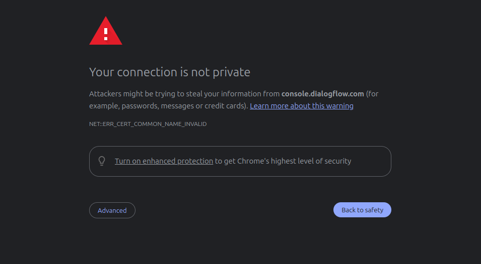
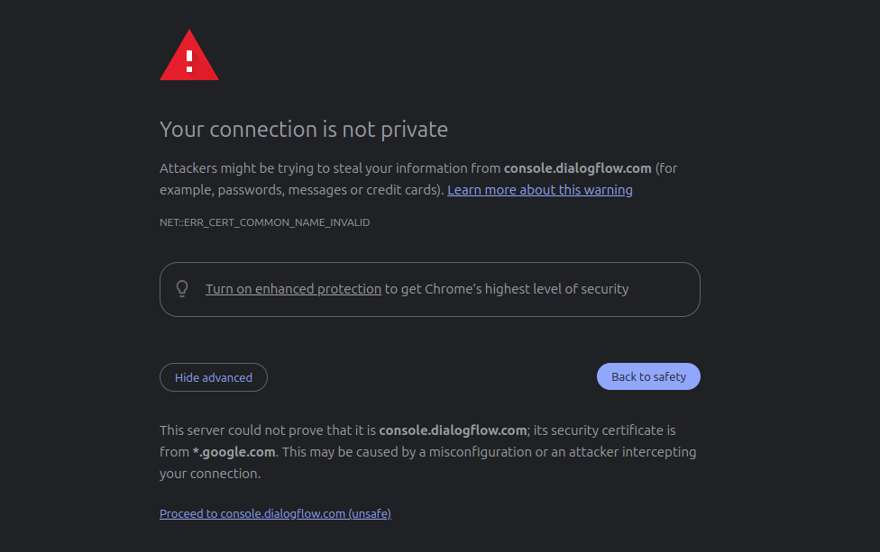
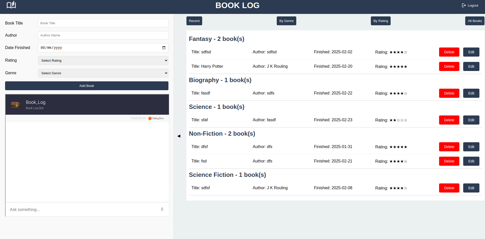

# Book Log 📚

## Overview

Book Log is a web application that allows users to track and manage their reading history. Users can log books they've read, including details like title, author, date finished, rating, and genre. The app provides features for adding, editing, and filtering books, along with user authentication.

## Usage
The site is live at https://ashveer1313.github.io/book-log/
1. Login/Signup to the site
2. If the chatbot is not opening follow the steps below:\
    a. Open https://console.dialogflow.com/api-client/demo/embedded/082e3d15-e8e6-4b21-bb57-e5af9a58a540 in another tab.\
    b.  Click on `Advanced` option\
    \
    c. Click on `Proceed to console.dialogflow.com(unsafe)` to open the chatbot.\
    \
    d. Visit the main site and refresh.\
    
## Features

### Authentication

- User registration and login
- Secure Firebase authentication
- Personalized book tracking

### Book Management

- Add new books to your reading log
- Edit existing book entries
- Delete books from your collection

### Filtering and Sorting

- Filter books by:
  - Recent reads
  - Genre
  - Rating
  - View all books

### User Interface

- Responsive design
- Collapsible left panel
- Intuitive book entry form
- Grouped book display by genre

### Bonus Features

- Integrated chatbot for book recommendations
- Visually appealing star rating system

## Technologies Used

- Frontend: HTML, CSS, JavaScript
- Backend: Firebase Firestore
- Authentication: Firebase Authentication
- Hosting: Github Pages

## Setup and Installation

### Prerequisites

- Modern web browser
- Firebase account
- Internet connection

### Steps

1. Clone the repository
2. Set up Firebase project
3. Replace Firebase configuration in `script.js`
4. Open `index.html` in a web browser

## Firebase Configuration

Ensure you have the following Firebase services enabled:

- Authentication (Email/Password)
- Firestore Database

## Project Structure

```
book-log/
│
├── index.html        # Main HTML file
├── style.css         # Styling
├── script.js         # Main JavaScript logic
│
├── public/
|   ├── app.png       # Application Screenshot
|   ├── step1.png     # Usage step image
|   ├── step2.png     # Usage step image
│   ├── book.png      # Logo
│   ├── logout.png    # Logout icon
│   └── book_black.png# Alternative logo
│
└── README.md         # Project documentation
```
## Authentication Flow
1. User enters email and password
2. Firebase authenticates credentials
3. Successful login reveals book management interface
4. User can add, edit, and delete books
## Filtering Mechanism
- Recent: Books read in last 3 months
- By Genre: Grouped by book categories
- By Rating: Sorted by highest rated books
- All Books: Complete reading history

## Improvements
I couldn't get a free working api for biometric authentication to work. It can be added later in future.
## Acknowledgements
1. Firebase
2. Google Fonts
3. DialogFlow (Chatbot integration)
